<div align="center">



<br>

[](https://github.com/Baylox/neatify/actions/workflows/ci.yml)
[](https://github.com/Baylox/neatify/actions/workflows/codeql.yml)
[](https://github.com/Baylox/neatify/releases/latest)
[](https://baylox.github.io/neatify/)
[](https://adoptium.net/)
[](./LICENSE)

**A small Java CLI that tidies a folder by moving files into category folders<br>(Documents, Images, Videos…) based on their extension — with a safe dry-run by default.**

[Install](#quick-start) · [Usage](#usage) · [Docs](docs/index.md) · [Security](docs/explanation/security.md)

</div>

---

##  What it does

Point Neatify at a messy folder and it sorts every file into a tidy set of category
folders, driven by simple extension rules. It **previews changes by default** (dry-run),
**journals every run** so you can undo it, and refuses to touch Git repos or system
directories.

```text
~/Downloads (before)              ~/Downloads (after  →  neatify --apply)
├── report.pdf                    ├── Documents/
├── invoice.docx                  │   ├── report.pdf
├── photo.png                     │   └── invoice.docx
├── screenshot.png        ──▶     ├── Images/
├── song.mp3                      │   ├── photo.png
├── movie.mkv                     │   └── screenshot.png
└── archive.zip                   ├── Music/      └── song.mp3
                                  ├── Videos/     └── movie.mkv
                                  └── Archives/   └── archive.zip
```

---

<a id="quick-start"></a>

##  Quick start

> **Requires Java 21+** (a JDK). That's the only thing you need — the jar is self-contained.

### Install (download the release)

Grab the latest `neatify-<version>.jar` from the
[releases page](https://github.com/Baylox/neatify/releases/latest) and run it:

```bash
# Download
curl -LO https://github.com/Baylox/neatify/releases/latest/download/neatify-1.0.1.jar

# Optional: verify the checksum
curl -LO https://github.com/Baylox/neatify/releases/latest/download/neatify-1.0.1.jar.sha256
sha256sum -c neatify-1.0.1.jar.sha256

# Run it
java -jar neatify-1.0.1.jar                                          # interactive menu
java -jar neatify-1.0.1.jar --source ~/Downloads --use-default-rules # preview (dry-run)
```

### Build from source

```bash
git clone https://github.com/Baylox/neatify.git
cd neatify
./mvnw package        # build target/neatify.jar  (.\mvnw.cmd on Windows)
```

Building also gives you the launchers — `./neatify` (Linux/macOS/WSL) and `.\neatify.cmd`
(Windows) — which run the jar so you never type `java -jar` again.

---

<a id="usage"></a>

##  Usage

```bash
./neatify                                                   # interactive menu
./neatify --source ~/Downloads --use-default-rules          # preview (dry-run)
./neatify --source ~/Downloads --use-default-rules --apply  # actually move files
./neatify --source ~/Downloads --undo                       # revert the last run
```

<sub>On Windows, use `.\neatify.cmd` (or `java -jar neatify-1.0.1.jar`).</sub>

**Shortcuts** (Linux/macOS/WSL) — a `Makefile` wraps the common flows:

```bash
make run                      # interactive mode
make preview DIR=~/Downloads  # dry-run on DIR
make apply   DIR=~/Downloads  # organize DIR for real
make help                     # list all targets and variables
```

---

##  Documentation

Full docs live in [`docs/`](docs/index.md):

| Guide | What's inside |
|-------|---------------|
| [Getting started](docs/getting-started.md) | Install, build, first run |
| [Interactive mode](docs/guides/interactive-mode.md) | The menu-driven flow |
| [Rules](docs/guides/rules.md) | Map extensions to folders (+ built-in defaults) |
| [Undo](docs/guides/undo.md) | Reverse a run |
| [CLI reference](docs/reference/cli.md) | Every option (generated from the code) |
| [JSON output](docs/reference/json-output.md) | Machine-readable results |
| [Architecture](docs/explanation/architecture.md) | How it works |
| [Security](docs/explanation/security.md) | Protections and rationale |
| [API (Javadoc)](https://baylox.github.io/neatify/) | Generated from the source |

---

##  Safety by default

| | |
|---|---|
| **Dry-run first** | Nothing moves until you pass `--apply`. |
| **Undo any run** | Every run is journaled under `.neatify/runs/`. |
| **Repo-aware** | Refuses `--apply` inside Git/VCS worktrees. |
| **Path-safe** | Blocks system dirs, path traversal and symlink escapes. |
| **Atomic moves** | Collision strategy (`rename` / `skip` / `overwrite`), no silent overwrite. |

---

##  Quality gate

`./mvnw verify` runs the full gate: Enforcer (JDK 21+), JUnit 5, JaCoCo (≥ 55% line
coverage), Spotless, SpotBugs and PMD — and the CI runs it on **Linux, macOS and
Windows**, plus CodeQL scanning.

```bash
./mvnw spotless:apply           # auto-format
./mvnw verify -Psecurity-scan   # OWASP CVE scan (set NVD_API_KEY)
```

<sub>On a network share without file locking (e.g. `\\wsl.localhost` from Windows),
redirect the build dir: `./mvnw verify -Dneatify.buildDirectory=C:\tmp\neatify-target`.</sub>

---

##  License

[MIT](./LICENSE) © [Baylox](https://github.com/Baylox)
